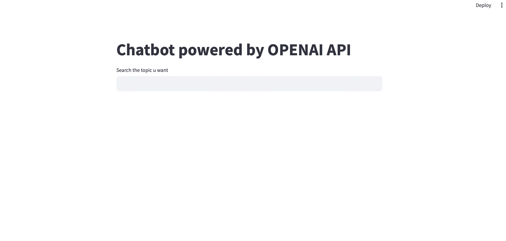
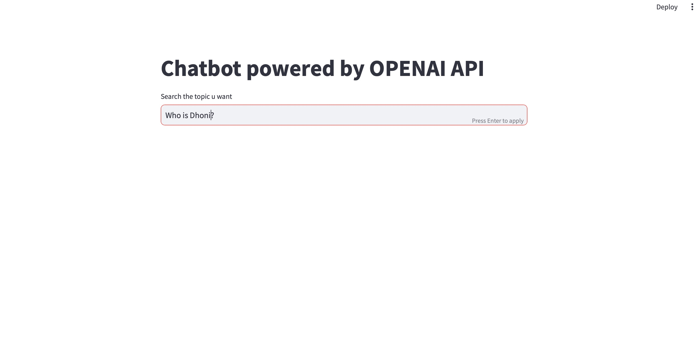
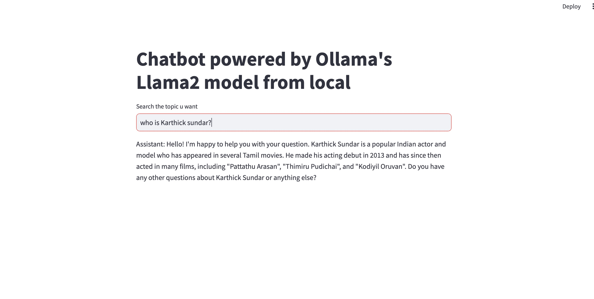

# LangChain-Chatbot
### Installation guide

Create a seperate environment just in case to avoid any conflicts with other packages already installed in your system

##### Steps to create a seperate conda environment
The below command creates a new environment with python3.10 installed in it. 
Feel free to change the "env_name" to any custom name of your choice

>conda create -n env_name python=3.10

Activate the environment by executing the following command

> conda activate env_name

##### pip installation of the python package

1. Open the folder containing the python package

2. Go to terminal and run the requirements.txt file
   
3. The above code will install all the dependencies and install the entire package and its backend code in your system

### Project structure

Below is the overall project structure under the folder name Koodoo-AI-Call-Center
```bash

Koodoo-AI-Call-Center
   ├── gpt_chatbot.py
   ├── llama_chatbot.py
   ├── README.md
   └── requirements.txt
```

- gpt_chatbot.py   :  langchain driven openapi powered chatbot script 
- llama_chatbot.py :  langchain driven ollama powered chatbot script
- README.md        :  file with instructions and guidance to use the module
- setup.py         :  file that contains commands to build the python package
- requirements     :  contains all the python package dependencies required for the module
- constants.py     :  contains all the constant literal values and also the variable names which does not need to be changed

### Sample execution

The installation guide above has reached till the point of setting up environment and having this python package installed.
Now below we will see, how to run the package with some example codes

> streamlit run ./gpt_chatbot.py

The above code should be executed from the terminal, which then runs the entire code base 
with the streamlit app hosted on local and remote server. 

#### Sample execution
The application start page looks like the below shown image

>

The above image clearly shows the feature of text area for the user to type in anything they are searching for

>

Click on the "Enter button" on keyboard to trigger the process. The result is generated and displayed below the text box

>

The same can be implemented using llama powered chatbot by running the following command,

> streamlit run ./llama_chatbot.py

>
